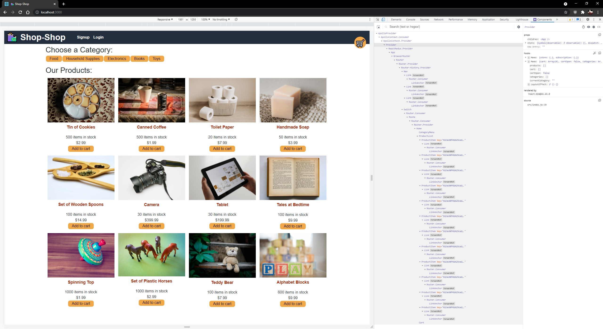
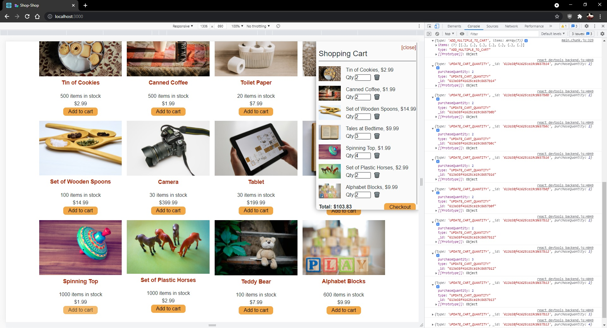

# Shop Shop - Redux
Week 22 Challenge - Refactor exisiting React web application to utilize Redux rather than Context API

<a href='https://shop-shop-redux-tony.herokuapp.com/' target="_blank">Live deployment</a>

## Table of Contents
* [Criteria](#criteria)
* [Installation and Usage](#installation-and-usage)
* [Features](#features)
* [Contributions](#contributions)
* [Final Results](#final-results)

## Criteria
* Redux manages global state rather than Context API
* React front end uses a Redux provider to access store
* Changes to global state are passed by app to a reducer to a Redux store
* App extracts state data from Redux store
* App dispacthes actions using Redux instead of Context

## Installation and Usage
Please visit the deployment link above to view the application.
* Free to browse shop
* Will need to login or create account to "purchase" items
* On checkout, linked to basic Stripe account
    * Enter all requested information, does not need to be real information
    * Enter 4242 4242 4242 4242 for the card number
    * Submit payment to proceed
* Redirected back to home page after payment
* Past orders available to be viewed in site

## Features
This web application allows users to add items within a shop to a cart and checkout/make a payment using Stripe.

This application uses the following technologies:
* React
* MongoDB
* Mongoose ODM
* Node.js
* Express.js
* Redux

## Contributions
Refactoring done by Tony Huang. Follow me on <a href="">GitHub</a>.

## Final Results

Main landing page, with Redux as main provider

Actions and reducers being called